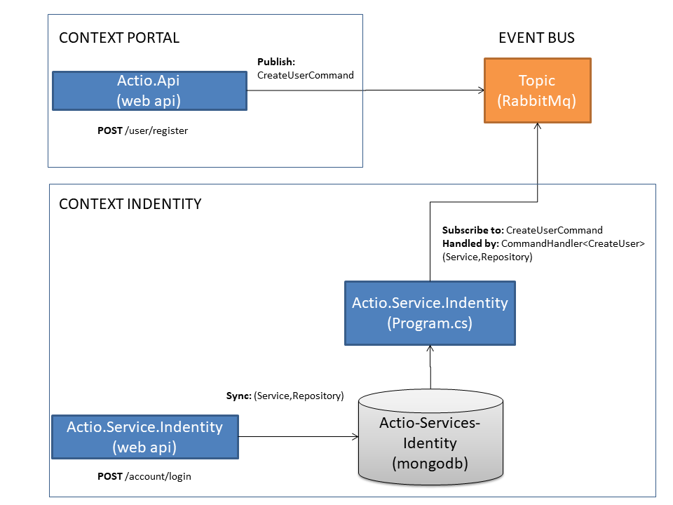

# .NET Core Microservices

<h3>Event-Driven Microservices with Dotnet and AWS, Lambda, Docker, Kafka, RabbitMQ, etc.</h3>
Link udemy: https://www.udemy.com/course/net-core-microservices
 

 
Arquitetura:
  

 
